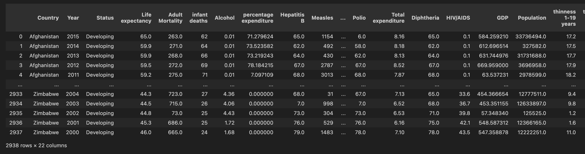
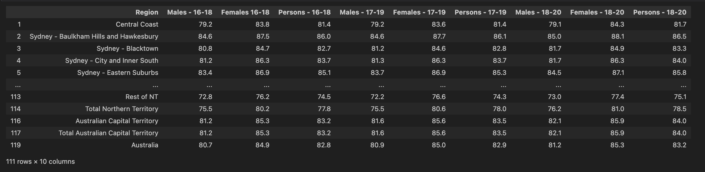
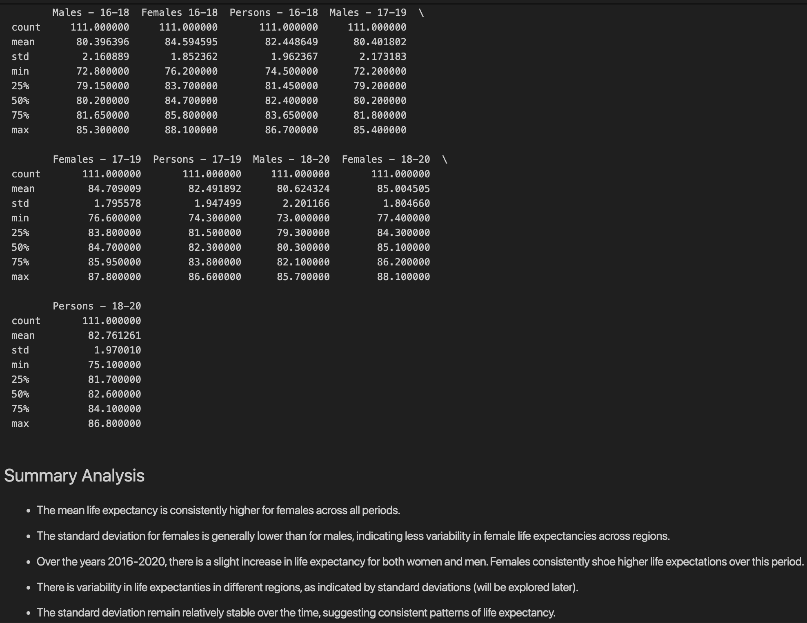
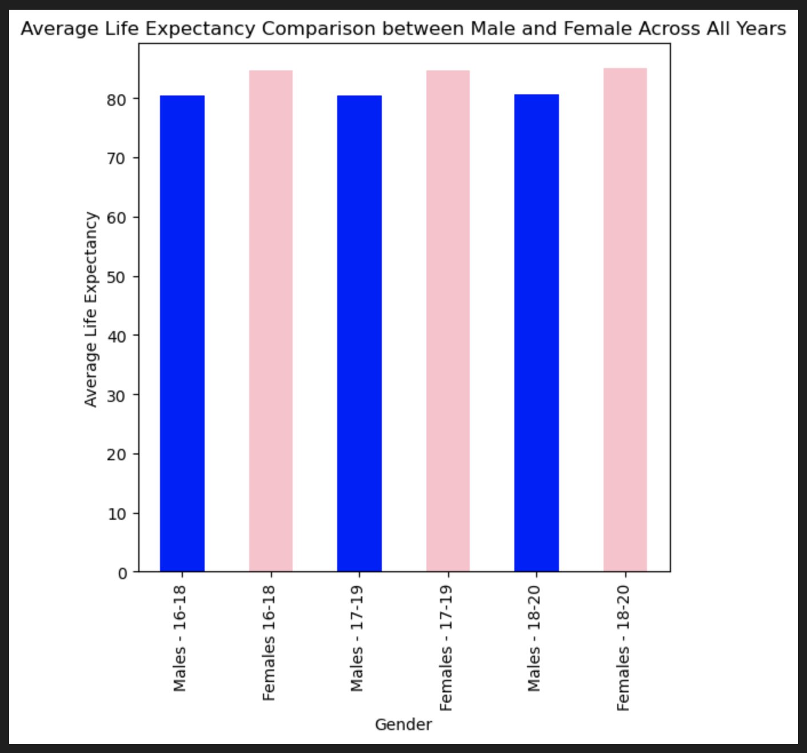
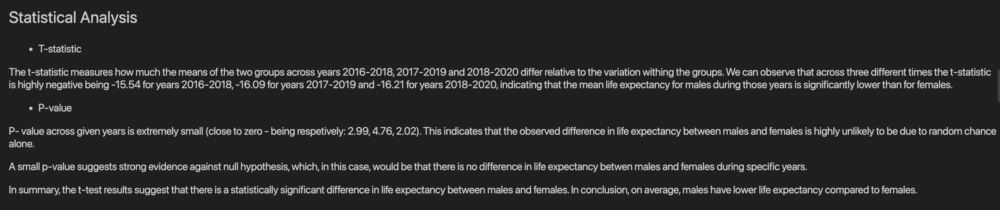
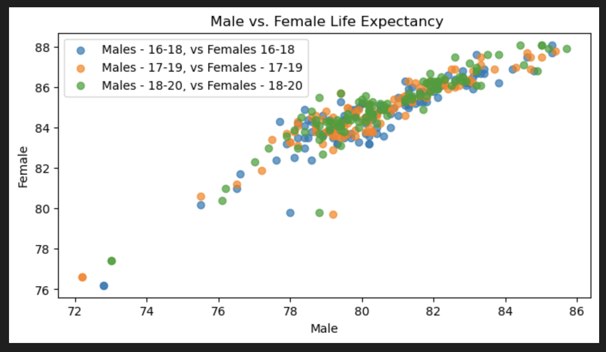
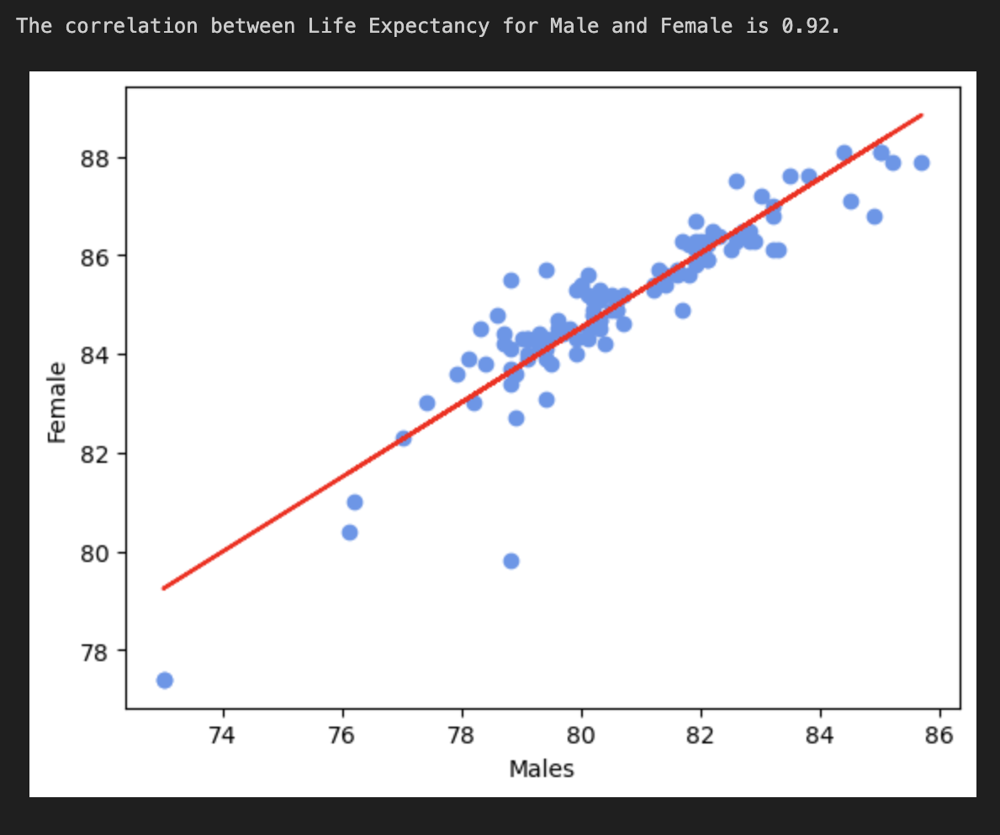
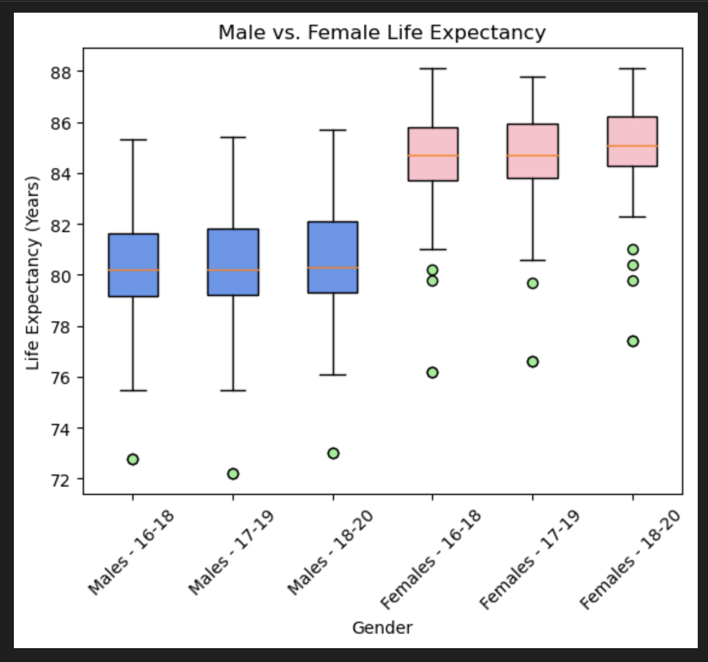

# Project-One

In this project, our focus is on leveraging various data sources and files to craft and manipulate DataFrames using the power of Pandas 🐼. Our goal is to employ a range of analytical and visualization techniques to unravel insights from the datasets at our disposal. The overarching questions guiding our exploration include:

Does financial wellness impact life expectancy? 💰 :money_with_wings:

Does health expenditure impact life expectancy? :hospital:

Does residency location impact life expectancy? :house:

Does gender impact life expectancy? 🧍‍♀️🧍‍♂️

# Background
This project delves into the complex web of factors that influence life expectancy, aiming to unravel key insights into longevity. The exploration includes various dimensions:

* Examining average/median income by state and life expectancy by state to assess potential correlations between financial well-being and access to healthcare, and their impact on longevity.

* Analyzing health expenditure by country and life expectancy by country to investigate potential relationships between healthcare investment and life expectancy.

* Investigating the influence of living in metropolitan vs. regional areas in Australia on access to healthcare and its potential impact on life expectancy.

* Assessing the impact of gender on life expectancy and understanding any observed variations.

Through statistical analysis, visualization techniques, and a comprehensive exploration of diverse datasets, this project aims to shed light on the intricate interplay of these factors in shaping life expectancy outcomes. The ultimate goal is to contribute valuable insights for informed decision-making in healthcare and public policy.

### Objectives

#### Data Preparation and  Tasks
For this project, we meticulously selected data from reputable sources, such as the Australian Bureau of Statistics and Kaggle. Transforming raw data into a usable format, we converted it into CSV files. Our next steps involved thorough cleaning and merging, ensuring that the data is cohesive and ready for analysis 📊

#### Life Expectancy and Finnancial Wellness 💰 :money_with_wings:

#### Life Expectancy and Health Expenditure :hospital:

#### Life Expectancy and Residency/ Location :house:

#### Life Expectancy and Gender 🧍‍♀️🧍‍♂️

*Step by Step:* 

* Cleared and re-named the columns to obtain a workable dataset in clear format.

* Created a Summary Statistic to understand database:

* Analysed and visualized data across years 2016-2020 (individually and combined) in a Bar Graph format outlining difference in Life Expectancy in Males (blue) and Females (pink):

* Conducted statistical evaluation using T-test and P-value to determine if the observed differences in life expectancy are likely due to chance or they are statistically significant:

* Visualised data across all years using Scatter plot to test the relationship between Female and Male Life Expectancy (observe the trend):

* Calculated and visualised correlation to asses the strength and direction of a linear relationship: 

* Filtered data in order to create Box Plot.
* Created and visualised data across all years using Box Plot to establish distribution of dataset and identify if data is impacted by possible outliers:

* Provided Summary Analysis for each major point.

#### Technologies used
* *Visual Studio Code - **Python** Software*
* *Excel* 
* *GitHub* 
* **Pandas**
* **Jupyter Notebook**
* **Matplotlib**

#### File list
* life-expectancy.ipynb
* abs_stats.csv - resources file containing dataset
* life_expectancy_data.csv - resources file containing dataset
* Various Screen Shots

Cover Photo Source: https://www.pinterest.com.au/pin/795729827900751781/

Resources & Links:

AIWH - Australian Institute of Health and Welfare, list of datasets varying from different topics regarding  life expectancy & deaths.

Kaggle WHO - A report using large datasets from different countries about life expectancy.

##### Copyright
A. Czynszak, R. Jing, C. Lara, X. Li © 2024. All Rights Reserved.
