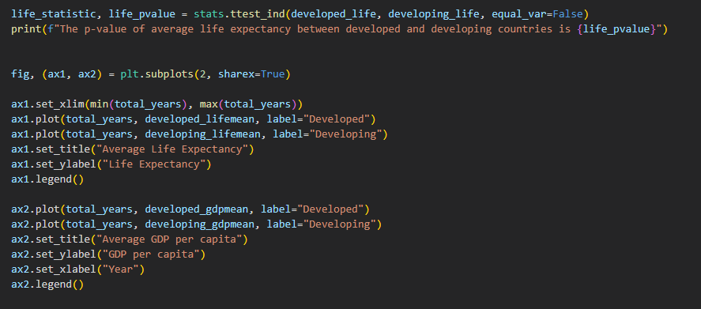
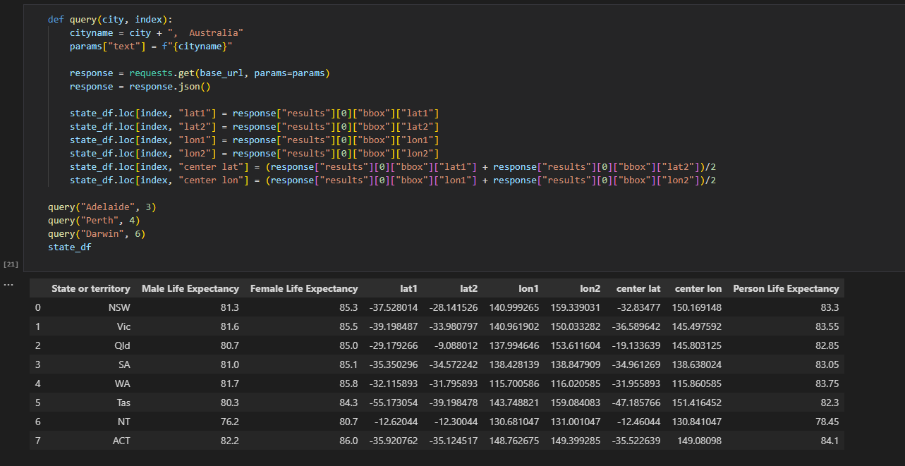

# Project-One

In this project, our focus is on leveraging various data sources and files to craft and manipulate DataFrames using the power of Pandas 🐼. Our goal is to employ a range of analytical and visualization techniques to unravel insights from the datasets at our disposal. The overarching questions guiding our exploration include:

Does health expenditure impact life expectancy? :hospital:

Does residency location impact life expectancy? :house: (Developed vs. Developing countries and States in Australia)

Does gender impact life expectancy? 🧍‍♀️🧍‍♂️

# Background
This project delves into the complex web of factors that influence life expectancy, aiming to unravel key insights into longevity. The exploration includes various dimensions:

* Examining average/median income by state and life expectancy by state to assess potential correlations between financial well-being and access to healthcare, and their impact on longevity.

* Analyzing health expenditure by country and life expectancy by country to investigate potential relationships between healthcare investment and life expectancy.

* Investigating the influence of living in developed vs. developing countries, as well as living in different states in Australia, and the potential impact on life expectancy.

* Assessing the impact of gender on life expectancy and understanding any observed variations.

Through statistical analysis, visualization techniques, and a comprehensive exploration of diverse datasets, this project aims to shed light on the intricate interplay of these factors in shaping life expectancy outcomes. The ultimate goal is to contribute valuable insights for informed decision-making in healthcare and public policy.

### Objectives

#### Data Preparation and  Tasks
For this project, we meticulously selected data from reputable sources, such as the Australian Bureau of Statistics and Kaggle. Transforming raw data into a usable format, we converted it into CSV files. Our next steps involved thorough cleaning and merging, ensuring that the data is cohesive and ready for analysis 📊

#### Life Expectancy and Gender 🧍‍♀️🧍‍♂️

*Step by Step:* 

* Cleared and re-named the columns to obtain a workable dataset in clear format.

* Created a Summary Statistic to understand database:

* Analysed and visualized data across years 2016-2020 (individually and combined) in a Bar Graph format outlining difference in Life Expectancy in Males (blue) and Females (pink):

* Conducted statistical evaluation using T-test and P-value to determine if the observed differences in life expectancy are likely due to chance or they are statistically significant:

* Visualised data across all years using Scatter plot to test the relationship between Female and Male Life Expectancy (observe the trend):

* Calculated and visualised correlation to asses the strength and direction of a linear relationship: 

* Filtered data in order to create Box Plot.
* Created and visualised data across all years using Box Plot to establish distribution of dataset and identify if data is impacted by possible outliers:

* Provided Summary Analysis for each major point.
  

#### Life Expectancy and Health Expenditure :hospital:
*Step by Step:* 

* Merged two csv files into one dataframe:

* Cleaned data, dropped NA and 0 values, renamed columns, only kept columns/variables of interest:

* View of mean values of variables grouped by Status ("Developed" and "Developing"):

* View of mean values of variables grouped by Status and Year:

* Visualisation of Developing vs. Developed on life expectancy:

* Visualisation of Developing vs. Developed on health expenditure:

* Visualisation of Developing vs. Developed against life expectancy vs. health expenditure:

* Calculated relationship between life expectancy and health expenditure for Developing countries:

* Calculated relationship between life expectancy and health expenditure for Developed countries:

* Calculated relationship between life expectancy and health expenditure for all countries:

#### Life Expectancy and Residency/ Location :house:
*Step by Step:* 

* Properly read the data sets:

* Clear the data base and rename columns to make the data frame more readable

* Define two functions: 
* Function select_data returns all the life expectancy and GDP data in a given year for a given country status (developed or developing)
* Function meanlife calls select_data to get the raw life expectancy and GDP data, calculate the average of these data and return them

* Create 7 empty lists to collect: 
* 1.total number of years 
* 2.raw life expectancy data for developed countries
* 3.raw life expectancy data for developing countries
* 4.Average life expectancy data for developed countries
* 5.4.Average GDP data for developed countries
* 6.Average life expectancy data for developing countries
* 7.4.Average GDP data for developing countries

* Put the Average life expectancy and GDP data for both developed and developing countries into a DataFrame

* Run a test on raw life expectancy data between developed  and developing countries, p value = 7.093327429544901e-23

* Plot 2 figures:
* 1.The top figure is average life expectancy of Developed countries vs Developing countries
* 2.The bottom figure is average GDP per capita of Developed countries vs Developing countries

* Mannually adding countries to 9 countries groups
* 1.Developed Asian Countries
* 2.Developed European Countries
* 3.Developed North American Countries
* 4.Developed Oceania Countries
* 5.Developing Asian Countries
* 6.Developing European Countries
* 7.Developing African Countries
* 8.Developing North American Countries
* 9.Developing South American Countries

* Put all these groups into a list
* Create country group labels for further uses, these labels are in the same order with the above list

* create 3 empty list to collect:
* 1.Average life expectancy of groups in 2000 - meanlist_2000
* 2.Average life expectancy of groups in 2015 - meanlist_2015
* 3.The above two lists zipped with group labels - mylist

* Define two functions:
* 1.meangroup_2000 runs a for loop to collect life expectancy data in 2000 for each of 9 country groups I made, return the average of the data
* 2.meangroup_2015 runs a for loop to collect life expectancy data in 2015 for each of 9 country groups I made, return the average of the data

* A for loop to iterrate through the country groups, and 
* call meangroup_2000 to get 9 average numbers, and save them into meanlist_2000
* call meangroup_2015 to get another 9 average numbers, and save them into a meanlist_2015
* Zip the grouplabels with meanlist_2000 and meanlist_2015, and save them into mylist

* Make mylist a pandas DataFrame and show the table

* Create a copy of the database
* Using a enumerate for loop to add a new column in the copied database, and add group labels to the selected coutries in the country group
* Countries in the 9 groups created above, will get a label in 1-9 based on their corresponding country group
* Drop all the countries without a label
* Create a new data frame selected_df that only contains columns of group label and life expectancy data
* Draw a boxplot for the selected_df, and replace the xticks with group labels we made earlier

* Create a empty list and use a for loop to collect life expectancy data from each group labels, so the list will have 9 sets of data
* use[] to access the desired set of data to do ANOVA tests and muliple T tests
* ANOVA tests on develped and developing groups
* ANOVA test on developed group without NA(US)
* T test between developing Asia and Europe, and display each group's average life expectancy
* T test between developing Africa and South America, and display each group's average life expectancy
* T test between developing Europe and South America, and display each group's average life expectancy

* Merge male and female life expectancy data each state in Australia
* show the table and create new columns for api data reception
* create basic api parameters

* Use for loop to iterrate through each row in the table
* Call geoapify to retrieve data for the newly created columns
* Calculate the center point of the state for drawing purposes
* Three state without latitude and longitutude data

* Create a function to take in a city name and row index, since we dont get SA, WA, and NT data, Adelaide, Perth, and Darwin are used instead
* The funtion will make an api call to filling the corresponding data
* Show the finished table

* Merge the table with Australian population data by 
* Divide the population size by 10 for better drawing experience
* Fix the population unit from /thousands to /ten thousands
* Show the table

* Draw the map by using hyplot
* Size of the cycle is based on population size of that state
* Hovering on the cycle will show the male and femal life expectancy data
* Show the map

#### Technologies used
* *Visual Studio Code - **Python** Software*
* *Excel* 
* *GitHub* 
* **Pandas**
* **Jupyter Notebook**
* **Matplotlib**

#### File list
* life-expectancy.ipynb
* abs_stats.csv - resources file containing dataset
* life_expectancy_data.csv - resources file containing dataset
* Various Screen Shots

Cover Photo Source: https://www.pinterest.com.au/pin/795729827900751781/

Resources & Links:

AIWH - Australian Institute of Health and Welfare, list of datasets varying from different topics regarding  life expectancy & deaths.

Kaggle WHO - A report using large datasets from different countries about life expectancy.

##### Copyright
A. Czynszak, R. Jiang, X. Li © 2024. All Rights Reserved.
